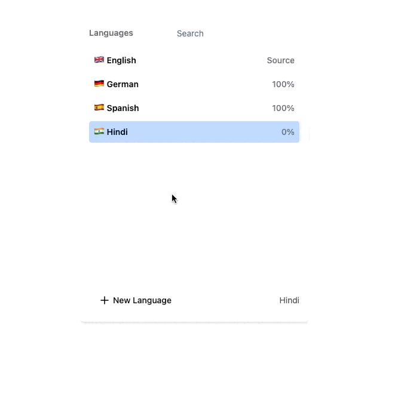

# LanguagesList Component

This is a simple React component built using [Next.js](https://nextjs.org/) and styled with [TailwindCSS](https://tailwindcss.com/). The `LanguagesList` component allows users to view, search, and add languages from a predefined list.

  

